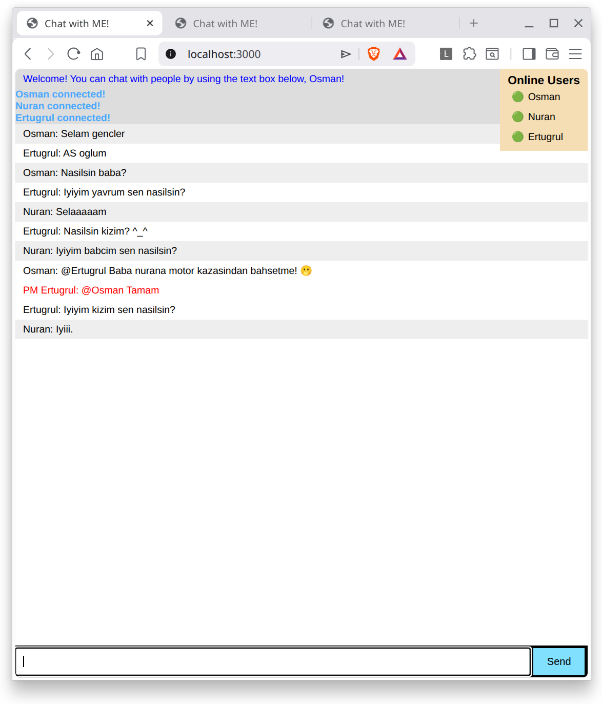
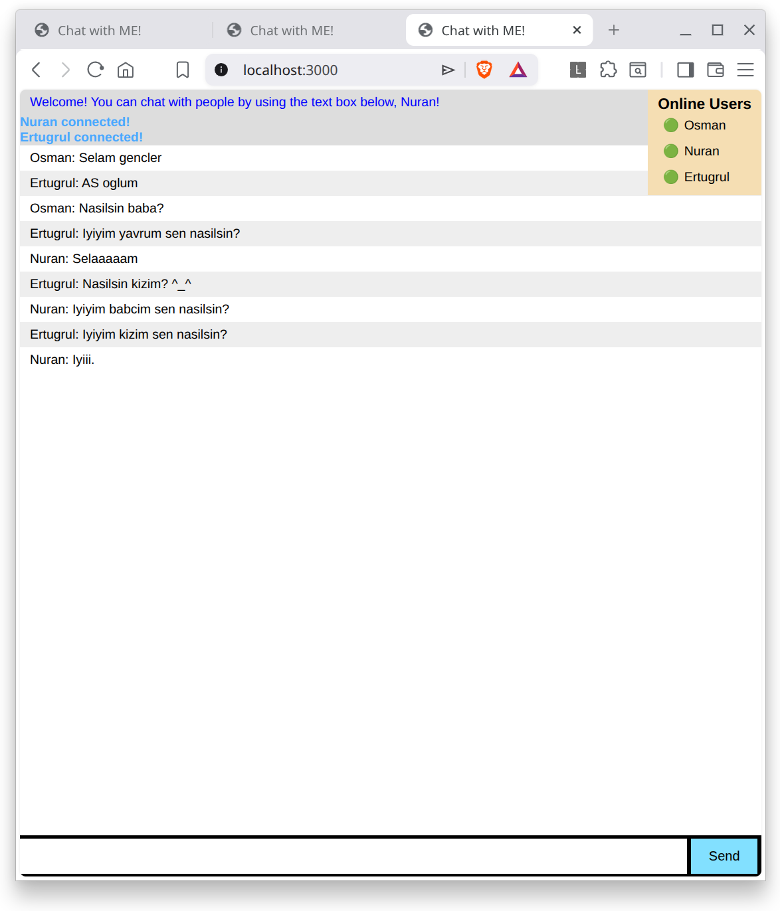
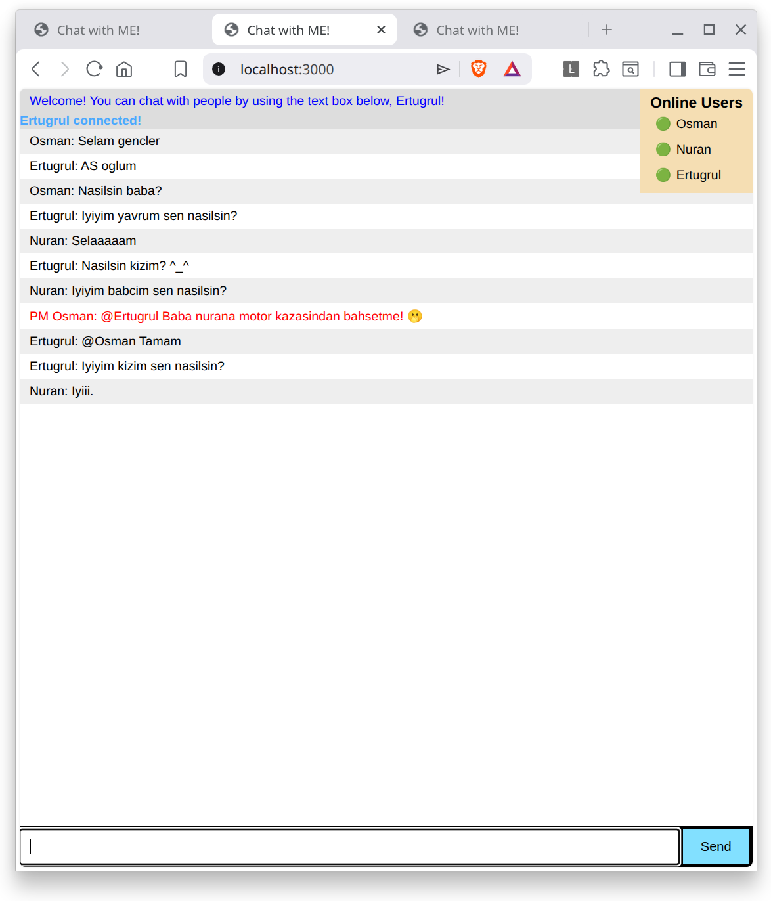

## Chat Application with Node.JS
You can follow [this tutorial](https://socket.io/get-started/chat/) to create
a likewise application.

So far my progress:

- [x] Broadcast a message to connected users when someone connects or disconnects
- [x] Add support for nicknames
- [x] Don’t send the same message to the user that sent it himself. Instead, append the message directly as soon as he presses enter.
- [x] Add “{user} is typing” functionality
- [x] Show who’s online
- [X] Add private messaging
- [X] Share your improvements!

### How to Use
1. Clone the repo `git clone https://github.com/pegasuspect/chatApp.git`
1. CHange directory in terminal to the downloaded folder: `cd chatApp`
1. Install packages with npm: `npm install`
1. Start the applicaiton: `node index`
1. Open your browser and go to: http://localhost:3000/
1. Start a new tabs to join the chat room.

#### Bonus
You can also find your own ip address and allow port 3000 on your firewall to chat with other computers or phones in your wifi network. This is more advanced so I won't explain how to do this here. You can use an LLM to figure this out if you want.

### Screenshots
|Osman (PM w/ Ertugrul) |Nuran (Blind Participant) |Ertugrul  (PM w/ Osman)|
|--|--|--|
|  |  |  | 